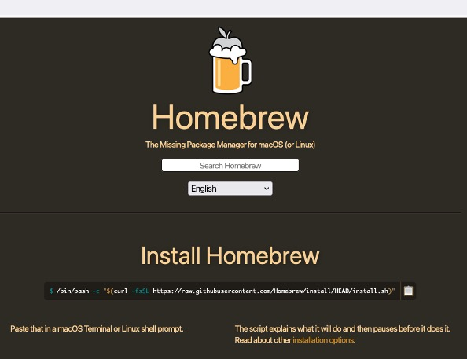
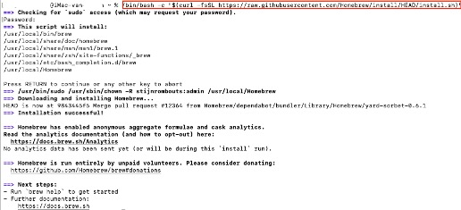
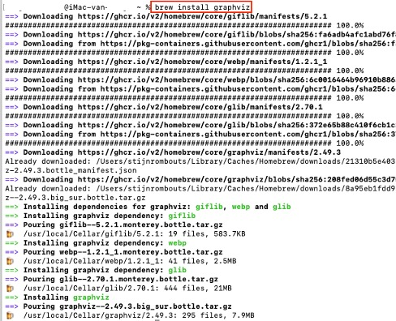

## Installing Graphviz

### Download Homebrew
- Go to the [Homebrew website](https://brew.sh/).

- Copy the command and paste it into terminal.

- Enter your password when needed.

- Enter the "brew install graphviz" command in terminal.

